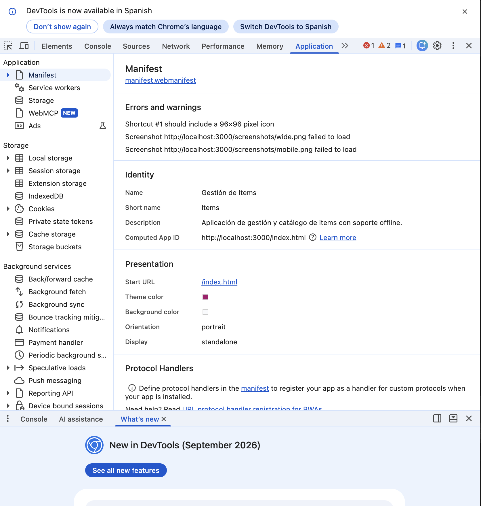
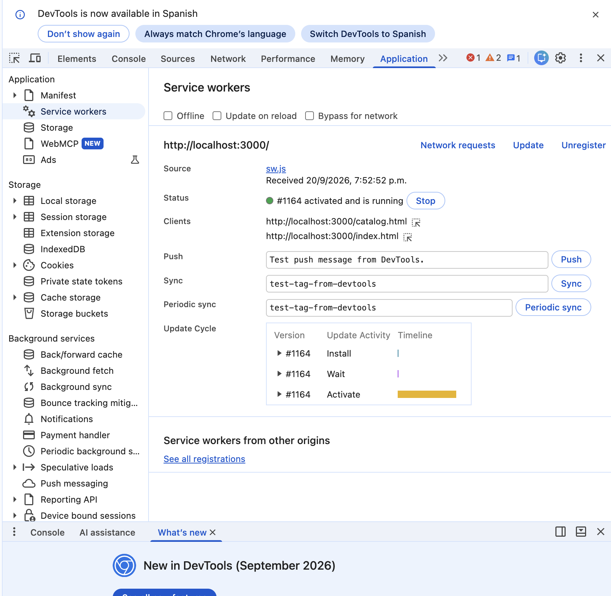
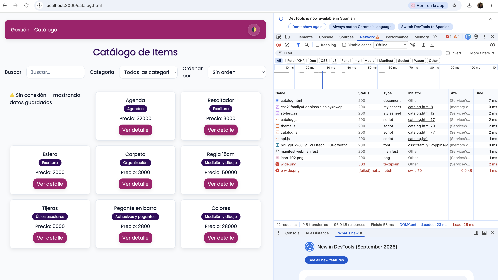
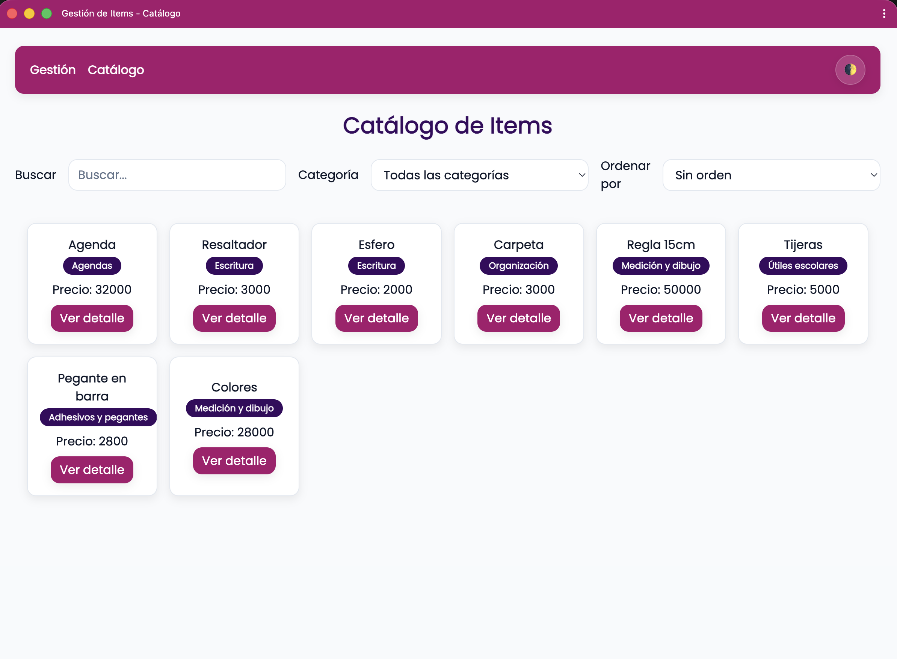

# 📦 TDM Taller 4 — Gestión de Items (PWA)

Aplicación web **Progressive Web App (PWA)** para gestionar y catalogar ítems de papelería. Permite crear, editar, eliminar y buscar ítems, con soporte **offline** mediante Service Worker y caché.

---

## ✅ Requisitos previos

Antes de correr el proyecto asegúrate de tener instalado:

| Herramienta | Versión mínima recomendada |
|-------------|---------------------------|
| [Node.js](https://nodejs.org/) | v18 o superior |
| [npm](https://www.npmjs.com/) | v9 o superior |

> No se requiere base de datos externa. Los datos se almacenan en `src/data/items.json` usando [lowdb](https://github.com/typicode/lowdb).

---

## 🚀 Cómo correr el proyecto

### 1. Clonar el repositorio

```bash
git clone https://github.com/MartinezYeimy/TDM_TALLER_4.git
cd TDM_TALLER_4
```

### 2. Instalar dependencias

```bash
npm install
```

### 3. Configurar variables de entorno

Copia el archivo de ejemplo y ajústalo si es necesario:

```bash
cp .env.example .env
```

Contenido del `.env`:

```env
PORT=3000
NODE_ENV=development
```

### 4. Correr en modo desarrollo

Este comando ejecuta en paralelo el servidor Express y el compilador de Tailwind CSS en modo watch:

```bash
npm run dev
```

Luego abre tu navegador en: **http://localhost:3000**

### 5. (Opcional) Solo compilar el CSS para producción

```bash
npm run build:css
```

### 6. (Opcional) Correr solo el servidor

```bash
npm start
```

---

## 📁 Estructura de carpetas

```
TDM_TALLER_4/
├── .env.example              # Variables de entorno de ejemplo
├── .gitignore
├── package.json
│
├── public/                   # Archivos estáticos servidos al navegador (PWA shell)
│   ├── index.html            # Página principal — Gestión de ítems
│   ├── catalog.html          # Página de catálogo con búsqueda y filtros
│   ├── offline.html          # Página mostrada cuando no hay conexión
│   ├── manifest.webmanifest  # Manifiesto de la PWA
│   ├── sw.js                 # Service Worker (caché offline)
│   ├── css/
│   │   └── styles.css        # CSS compilado por Tailwind
│   ├── icons/
│   │   ├── icon-192.png
│   │   ├── icon-512.png
│   │   └── icon-512-maskable.png
│   └── js/
│       ├── main.js           # Lógica de gestión (CRUD de la tabla)
│       ├── catalog.js        # Lógica del catálogo (tarjetas + modal)
│       ├── theme.js          # Toggle de modo oscuro/claro
│       ├── services/
│       │   └── api.js        # Funciones fetch hacia la API REST
│       └── ui/
│           └── ui.js         # Helpers de renderizado del DOM
│
└── src/                      # Código del servidor (Node.js + Express)
    ├── server.js             # Punto de entrada — levanta el servidor
    ├── app.js                # Configuración de Express (middlewares, rutas)
    ├── data/
    │   └── items.json        # Base de datos JSON (gestionada por lowdb)
    ├── db/
    │   └── db.js             # Funciones CRUD sobre items.json
    ├── middlewares/
    │   ├── validate.js       # Validación de campos en POST y PUT
    │   └── errors.js         # Manejadores de error 404 y 500
    ├── routes/
    │   └── items.js          # Rutas de la API REST /api/items
    └── styles/
        └── input.css         # Archivo de entrada de Tailwind CSS
```

---

## 🔌 Tabla de la API REST

**Base URL:** `http://localhost:3000/api`

| Método | Endpoint | Descripción | Body requerido |
|--------|----------|-------------|----------------|
| `GET` | `/api/items` | Obtiene todos los ítems (con filtros opcionales) | — |
| `GET` | `/api/items/:id` | Obtiene un ítem por su ID | — |
| `POST` | `/api/items` | Crea un nuevo ítem | JSON con campos del ítem |
| `PUT` | `/api/items/:id` | Actualiza un ítem existente | JSON con campos a modificar |
| `DELETE` | `/api/items/:id` | Elimina un ítem por su ID | — |

### Query params disponibles en `GET /api/items`

| Parámetro | Tipo | Descripción | Ejemplo |
|-----------|------|-------------|---------|
| `q` | `string` | Busca por texto en `name` o `description` (insensible a mayúsculas) | `?q=agenda` |
| `category` | `string` | Filtra por categoría exacta (ver valores permitidos abajo) | `?category=Escritura` |
| `sort` | `string` | Ordena resultados de menor a mayor. Valores: `price` o `stock` | `?sort=price` |

**Ejemplo combinado:**
```
GET /api/items?q=esfero&category=Escritura&sort=price
```

---

## 🗂️ Modelo de datos

Cada ítem almacenado en `src/data/items.json` tiene la siguiente estructura:

```json
{
  "id": 1,
  "name": "Agenda",
  "description": "Agenda de 100 hojas",
  "price": 32000,
  "stock": 23,
  "category": "Agendas",
  "date": "2026-08-31"
}
```

### Campos del modelo

| Campo | Tipo | Requerido | Descripción |
|-------|------|-----------|-------------|
| `id` | `number` (entero) | Auto-generado | Identificador único, asignado por el servidor |
| `name` | `string` | ✅ Sí | Nombre del ítem |
| `description` | `string` | No | Descripción breve del ítem |
| `price` | `number` (≥ 0) | ✅ Sí | Precio en pesos colombianos |
| `stock` | `number` (≥ 0) | ✅ Sí | Cantidad disponible en inventario |
| `category` | `string` (lista cerrada) | ✅ Sí | Categoría del ítem (ver valores permitidos) |
| `date` | `string` (YYYY-MM-DD) | No | Fecha de registro del ítem |

### Valores permitidos para `category`

El campo `category` solo acepta los siguientes valores exactos (con mayúsculas tal como se muestran):

| Valor |
|-------|
| `Agendas` |
| `Escritura` |
| `Organización` |
| `Medición y dibujo` |
| `Útiles escolares` |
| `Adhesivos y pegantes` |
| `Papelería general` |
| `Arte y manualidades` |
| `Tecnología escolar` |
| `Archivadores y carpetas` |

> Si se envía un valor fuera de esta lista en `POST` o `PUT`, la API responde con `400 Bad Request` y un mensaje de error.

---

## 📱 Funcionalidades PWA

- ✅ **Instalable** como app nativa desde el navegador (botón 📲 Instalar)
- ✅ **Soporte offline**: muestra datos cacheados y página de "Sin conexión"
- ✅ **Service Worker** con estrategia Cache-first (shell) y Network-first (API)
- ✅ **Tema claro/oscuro** persistido en `localStorage`

---

## 🖼️ Capturas de pantalla (docs/)

### Application → Manifest sin errores


### Application → Service Worker en `activated`


### Network en Offline con la app funcionando


### App instalada (ventana propia, sin barra de direcciones)

